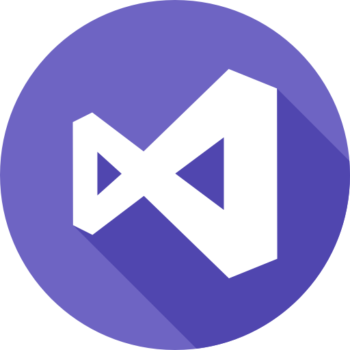
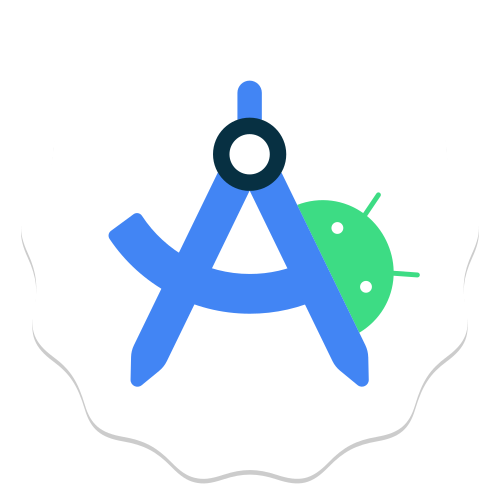
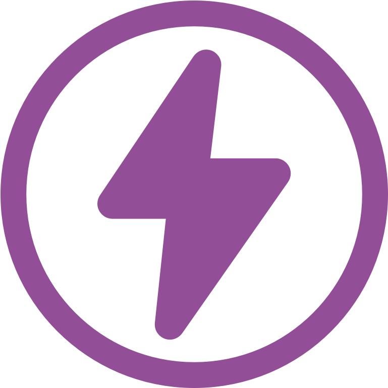
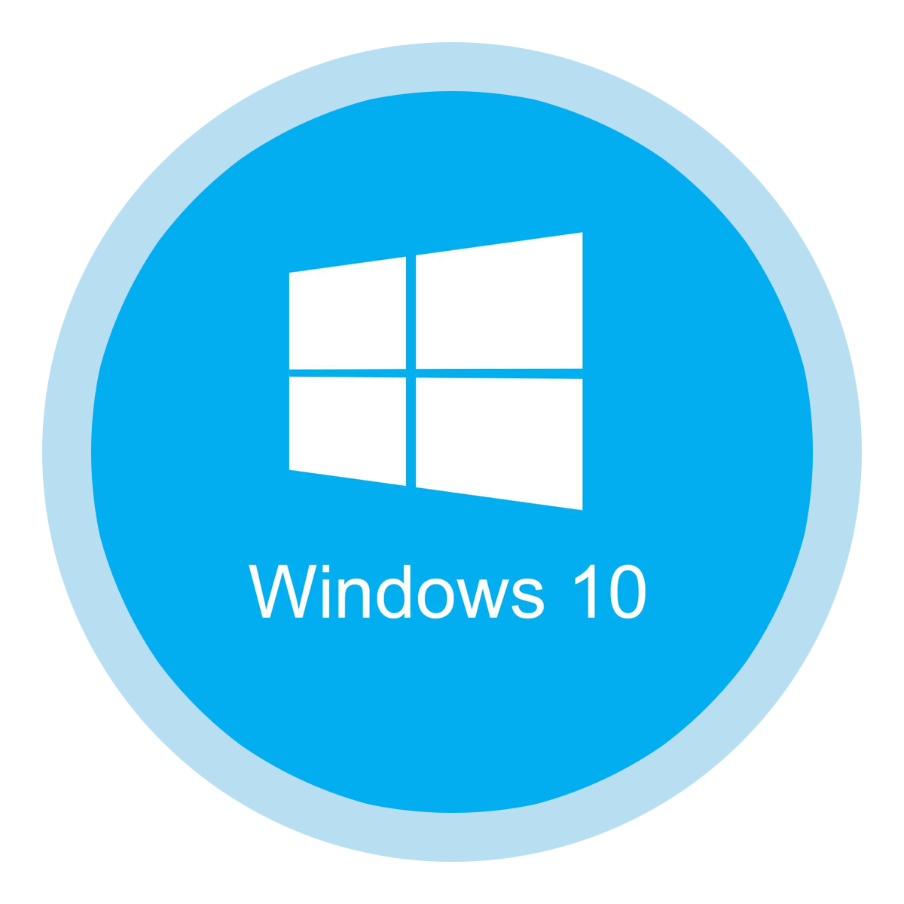
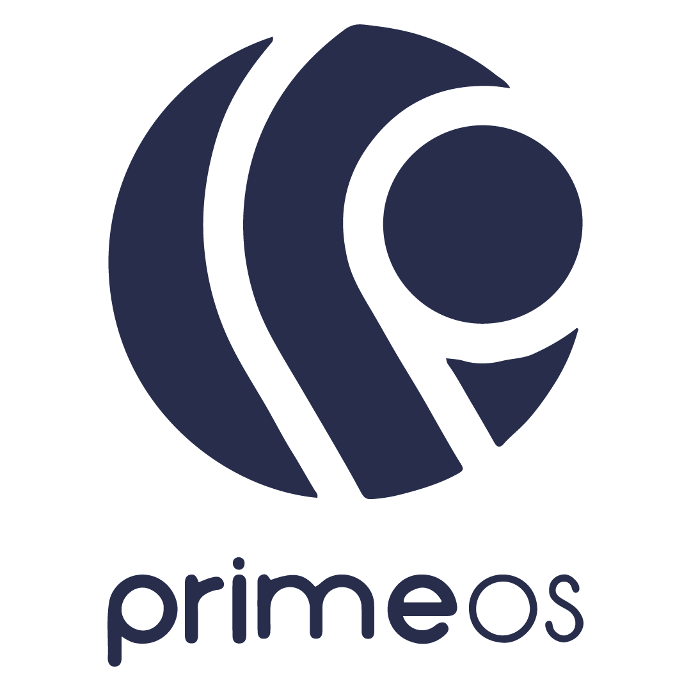

<h1 align="center">Hi 👋, I'm Amit Patel</h1>

<h3 align="center">
🚀 Founder @ AmitSolutionHub | Full Stack Developer | UI/UX Designer | Tech Problem Solver
</h3>

  
  

  

  

---

## 🚀 About Me

🎓 B.Tech IT Student  
🏢 Founder of **AmitSolutionHub**  
💻 Full-Stack Developer (MERN, PHP, .NET)  
🎨 UI/UX Designer & Creative Editor  
🖥 PC & Laptop Technician  

I love building practical systems that combine **clean design, security, and performance.**

---

## 🚀 My Journey

My journey into technology didn’t start with big resources — it started with curiosity and consistency.

In **2018**, I began learning web development with basic tools and a strong desire to create something meaningful. Step by step, I evolved from building simple static pages to developing dynamic, full-stack applications.

In **2020**, I entered the field of PC & Laptop repair. Working hands-on with hardware strengthened my troubleshooting skills and practical problem-solving ability.

Over the years, I combined:

- 💻 Full-Stack Development (MERN, PHP, .NET)
- 🎨 UI/UX & Creative Editing
- 🖥 Hardware & Technical Support
- 🔐 Secure Authentication & System Design

Today, as the Founder of **AmitSolutionHub**, my mission is to provide reliable, practical, and affordable digital solutions.

The journey is still in progress — and I’m committed to improving every day. 🚀

---

## 🌟 Vision & Mission

### 🎯 My Mission
To build reliable and practical digital solutions that solve real-world problems efficiently.

### 🔭 My Vision
To grow AmitSolutionHub into a trusted tech platform combining development, design, and technical support.

### 💡 Core Values
- 🚀 Continuous Learning  
- 🔐 Security First  
- 🎨 Creativity + Performance  
- 🤝 Trust & Transparency  
- 📈 Consistent Growth  

---

## 🛠 Tech Stack

### Development Tools

  
  
  
  
  

### Languages

### Frameworks & Libraries

### Databases & Cloud

### Tools & DevOps

  
  
  
  
  
  
  
  
  

### Creative & Other

  
  
  
  
  
  
  

### PC Technical Services Tools

  
  
  
  
  
  
  

### OS

  
  
  
  
  

## 💼 Expertise

### 💻 Development
- MERN Stack Applications  
- PHP & MySQL Projects  
- Authentication & Login Systems  
- Admin & Client Dashboards  
- Payment Integration (UPI/QR)  
- REST API Basics  

### 🖥 Technical Services
- PC & Laptop Troubleshooting  
- SSD / HDD / RAM Upgrades  
- Windows Installation & BIOS Fix  
- System Optimization  
- Network & WiFi Setup  

---
# 📊 GitHub Stats:
 
 

## 📫 Connect With Me

  
  
  

---
## Coding  Platform

---
⭐ **"Building Solutions. Solving Problems. Creating Impact."**
